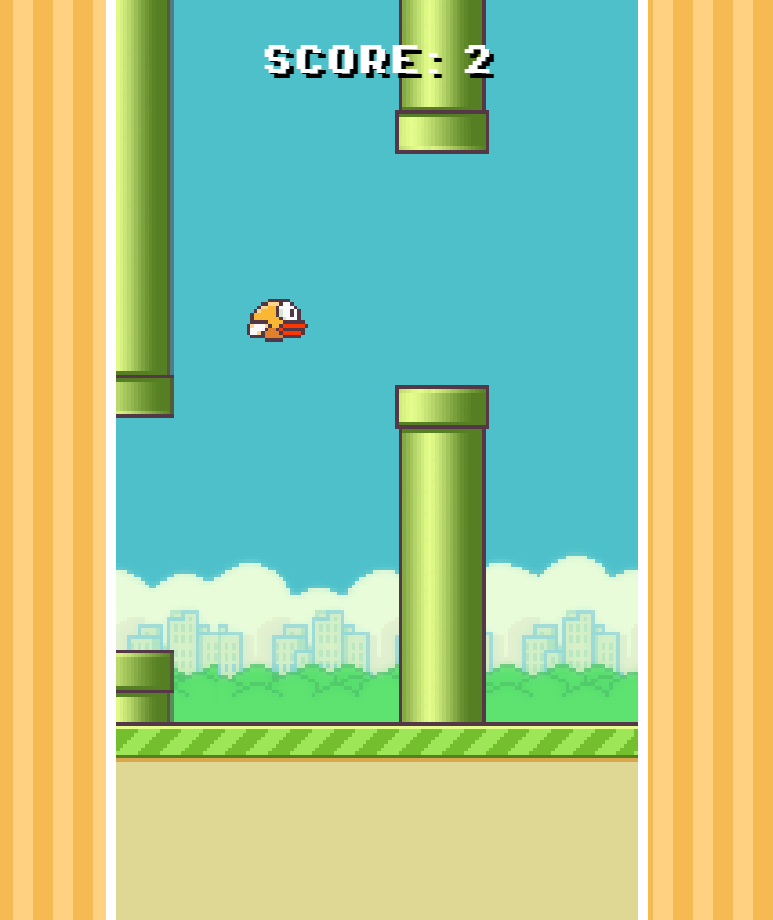

# Flappy Bird JS

## From-scratch version of Flappy Bird built in plain JavaScript/CSS/HTML

**Flappy Bird JS** is a simple copy of the popular *Flappy Bird* built in a week during my **JavaScript Game Development Course** in my University.

## How to Play:

You can play on your browser or in your mobile phone.

### Browser:
Any key input or click makes the bird `Jump`

### Mobile:
Tap anywhere on the screen to make the bird `Jump`

## Building for mobile
The game can be deployed in mobile using `Cordova`.

## Screenshot

    

